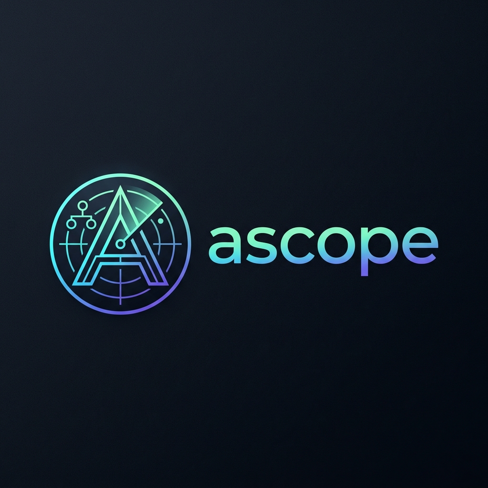

# AuraScope (`ascope`)



Blazingly fast terminal workspace inspector and navigation utility written in Rust.

`ascope` combines recursive workspace scanning, interactive tree navigation, live search, code previews, and shell warp integration into a single keyboard-driven terminal UI.

## Features

- Parallel filesystem scanning with `jwalk`
- Interactive TUI navigation with `ratatui` and `crossterm`
- Live search overlay for nested files and directories
- Read-only syntax-highlighted code previews via `syntect`
- Shell warp support so `asc` can change the parent shell directory on exit
- Multi-platform release artifacts for Linux, macOS, and Windows

## Build and Run

### Build from source

```bash
cargo build --release
```

### Run directly

```bash
cargo run -- .
```

### Stats-only mode

```bash
cargo run -- --stats .
cargo run -- --stats --json .
```

## Shell Warp Setup

The binary itself cannot change the parent shell directory. The Warp flow works by:

1. Running `ascope` with `--export-target <temp-file>`
2. Writing the final selected directory into that file on exit
3. Having a shell wrapper read the file and call `cd`

### Bash / Zsh

Add this line to your `~/.bashrc` or `~/.zshrc`:

```bash
source "/absolute/path/to/ascope/src/shell/ascope.sh"
```

Then reload your shell:

```bash
source ~/.bashrc
# or
source ~/.zshrc
```

You can now use:

```bash
asc .
```

### PowerShell

Add this line to your PowerShell profile:

```powershell
. "C:\absolute\path\to\ascope\src\shell\ascope.ps1"
```

Reload your profile:

```powershell
. $PROFILE
```

Then use:

```powershell
asc .
```

## Release Artifacts

Pushing a tag named `v*` triggers `.github/workflows/release.yml` and publishes these assets:

- `ascope-linux-amd64.tar.gz`
- `ascope-linux-amd64.deb`
- `ascope-linux-amd64.rpm`
- `ascope-macos-amd64.tar.gz`
- `ascope-windows-amd64.exe`

Note: AppImage is a Linux packaging format, not a macOS one. The macOS release therefore ships as a standard binary archive.

## Packaging Notes

Linux package metadata is defined in `Cargo.toml` for:

- `cargo-deb`
- `cargo-generate-rpm`

Linux release artifacts are built on `ubuntu-22.04` to keep the minimum `glibc` requirement low enough for Debian 12 / Ubuntu 22.04 class systems. This avoids the runtime breakage you get when building on newer `ubuntu-latest` images with a newer C library baseline.

The published GitHub release body is sourced from `.github/release-body.md` and intentionally uses plain project-style prose with no emoji decoration.
